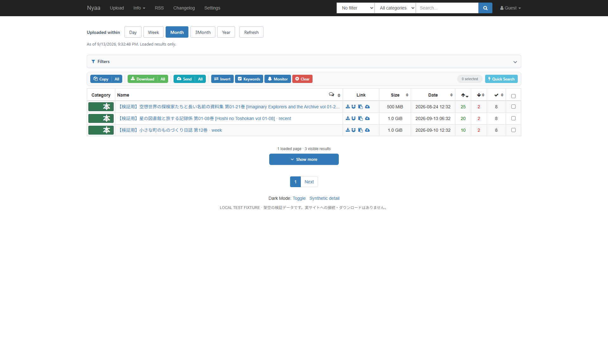

# Nyaa Enhancer Presets

[Arad119/Nyaa-Enhancer](https://github.com/Arad119/Nyaa-Enhancer) の Chrome 向け改造版です。投稿日で絞り、シーダーが多い順に結果を見られます。元作者の公式版とは別のプロジェクトです。

`nyaa.si` と `sukebei.nyaa.si` で起動します。検索や追加読み込みは、開いているサイトのドメインを保持します。

| プリセット | 対象期間 |
| --- | --- |
| Day | 直近24時間 |
| Week | 直近7日 |
| Month | 直近30日・初期選択 |
| 3Month | 直近90日 |
| Year | 直近365日 |

カレンダー上の今月・今年ではなく、検索開始時刻から遡ります。開始時刻はURLに保持され、追加ページも同じ境界で判定します。新しい時点で検索し直すときは **Refresh** を押してください。



公開テンプレート・CSSを用いた、自動読み込みを一時停止中のローカル検証画面です。表示内容は架空データです。[狭い画面のダーク表示](docs/images/presets-mobile-dark.png)も確認しています。

## 導入

[Releases](https://github.com/came815/nyaa-enhancer-presets/releases) から `-chrome.zip` をダウンロード・展開し、Chrome の `chrome://extensions` → デベロッパーモード →「パッケージ化されていない拡張機能を読み込む」で、`manifest.json` が直下にあるフォルダーを選びます。

元の Nyaa Enhancer と同時に有効にすると、同じページに二重に作用します。元版を使っている場合は無効にしてからこの改造版を有効にしてください。元版の設定は自動移行されません。

手順の詳細は [導入ガイド](docs/INSTALL.md) を参照してください。Chrome Web Store への登録は行っていません。Firefox 側のソースは上流のまま保存されており、この改造版のサポート対象外です。

## 使い方

1. 一覧上部の **Day / Week / Month / 3Month / Year** を選びます。
2. プリセット選択・Quick Search はシーダー降順で検索します。通常の並べ替えも期間条件を保ちます。
3. 末尾に近づくと続きを自動で取得します。期間選択欄はスクロール中も上部に残り、読み込み状態と件数を確認できます。
4. **Pause auto** で自動取得を止め、**Resume auto** で再開します。手動のオン・オフは保存されます。**Show more** で手動取得することもできます。
5. 通信エラーやアクセス制限、タイムアウト、10ページ連続で該当結果がない場合は自動取得を停止します。表示された理由を確認し、再開操作を行ってください。取得中は **Cancel** でも停止できます。

自動読み込みは初期状態でオンです。末尾の約600px手前から、1.5秒以上の間隔で順番に取得します。タブが非表示の間は新しい取得を始めません。再開時は未取得の次ページから続けます。

結果は読み込み済みの範囲だけです。検索上限や変動するシーダー数があるため、期間内の全件取得・厳密な一時点ランキングは保証しません。通信失敗・応答形式の変化・アクセス制限は、検索完了として扱わず取得を止めます。

## 検証と開発

```text
npm ci
npm test
npx playwright install chromium
npm run test:ui
```

ブラウザテストはローカルの架空データで行います。実サイトへのブラウザアクセスが実行環境のサイト安全ポリシーで拒否されたため、実サイトでの動作確認は未実施です。検証内容は [QA記録](docs/QA.md) に記載します。

変更をコミットした後、`npm run package` で Chrome ZIP・対応ソース ZIP・SHA256一覧を `dist/` に生成します。対応ソースを Chrome ZIP と同じリリースに置いて配布します。

## ライセンス・帰属

元コードと本改造版は **GNU GPL v3** で配布します。[LICENSE.txt](LICENSE.txt)、[改変記録](MODIFICATIONS.md)、[第三者の通知](THIRD_PARTY_NOTICES.txt)、[ライセンス注記](docs/LICENSE-NOTES.md) を参照してください。

ベース: `Arad119/Nyaa-Enhancer`、コミット `01dad601fe346fcb36178ed9a5fddc5aca7a56dc`。元の説明・謝辞は [上流READMEの保存版](docs/UPSTREAM-README.md) に保持しています。

上流の謝辞にある主なプロジェクト:
- [Nyaa AnimeTosho Extender (ION Fork)](https://github.com/IONI0/Nyaa-AnimeTosho-Extender-ION-Fork) — IONI0
- [NyaaBlue / SeaDex](https://releases.moe/) — ThaUnknown
